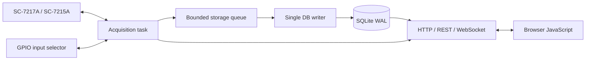

# labori

SC-7217A / SC-7215A 周波数カウンタを Raspberry Pi から制御し、測定・永続化・リアルタイム表示を行うデータ収集システムです。

labori 0.2 は、計測の堅牢性、時間分解能、正確性、性能、運用の簡潔さを優先し、単一の Rust サービスへ再設計されています。ブラウザ側には表示用の素の JavaScript だけを残し、Node.js サーバーや SQLite の二重アクセスは使用しません。

## 設計原則

- 計測器からの取得処理は、DB読出しやブラウザ描画を待たない
- SQLiteへの書込みは単一writerに限定する
- 全サンプルへセッションIDと単調増加する連番を付ける
- 時刻は浮動小数点秒ではなく、セッション開始からの整数ナノ秒で保存する
- 通信断は記録し、再接続後も同じセッションを継続する
- 保存キュー飽和時は黙って欠損させず、測定を失敗として終了する
- プロセス異常終了時のセッションは、次回起動時に `interrupted` として確定する
- ライブ表示はDBポーリングではなくWebSocketで配信する
- 履歴データはページングして読み出す

## 構成



Rustプロセス内でも責務は分離されています。

| モジュール | 責務 |
|---|---|
| `acquisition.rs` | SC-7217A通信、再接続、GPIO、サンプル生成 |
| `storage.rs` | WAL設定、スキーマ、バッチトランザクション、履歴読出し |
| `web.rs` | REST API、WebSocket、静的ファイル配信 |
| `model.rs` | APIと保存データの型 |
| `config.rs` | 設定読込と検証 |

## 測定方式

### 単一チャンネル

UIから次の二方式を選択できます。長時間測定と実時間に一致する時間軸を優先する場合は、既定の`:MEAS? direct`を使用してください。

#### `single_direct` — `:MEAS?`直接測定

```text
:FRUN 0
loop:
    単調時計で開始時刻を取得
    :MEAS?
    応答受信
    単調時計で終了時刻を取得
    サンプルを保存
```

周期調整用のsleepは追加しません。前回の応答を受信すると直ちに次の`:MEAS?`を送るため、Raspberry Pi側で加わる不要な待ち時間を最小化します。

各サンプルには実際の`started_ns`と`ended_ns`を保存します。LAN処理時間などによって測定間隔が伸びても、グラフとCSVの時間軸は実時間の経過を反映します。通信断中の時間も詰めません。

#### `single_log` — 計測器内蔵ログ

```text
:GATE:TIME
:LOG:LEN 5e5
:LOG:CLE
:FRUN 1
:LOG:DATA?
```

時間軸はゲート時間とサンプル連番から生成します。より高いスループットが期待できますが、計測器内部の実記録周期がゲート時間と一致しない場合、実時間とのずれが生じる可能性があります。

通信断が発生した場合は、ホストの単調時計から推定した欠損サンプル数をイベントとして保存します。

> [!IMPORTANT]
> `:LOG:DATA?`の取得済みデータ消費動作、1024 byte応答上限、内蔵ログ満杯時の動作は実機ファームウェアに依存します。長時間測定で実時間との一致が必要な場合は`single_direct`を選択してください。

### 多チャンネル

GPIOで入力を切り替えた後、`:MEAS?` を実行します。

```text
GPIO HIGH → 安定待ち → :MEAS? → GPIO LOW → 次チャンネル
```

各値には、コマンド送信直前と応答受信直後の単調時計時刻がナノ秒単位で保存されます。測定周期はゲート時間、入力安定時間、LAN往復時間の影響を受けます。

## 必要環境

- Raspberry Pi OS
- Rust stable toolchain
- IWATSU SC-7217A または SC-7215A
- 計測器へ到達可能なLAN
- 多チャンネル利用時はGPIO制御の入力切替回路

Node.jsとnpmは不要です。

## セットアップ

```bash
git clone https://github.com/korintje/labori.git
cd labori/back_client
```

`config.toml`を編集します。

```toml
device_addr = "192.168.201.44:5198"
measurement_function = "FINA"
listen_addr = "127.0.0.1:3000"
database_path = "labori.db"
web_root = "../web"

gpio_settle_millis = 10
instrument_timeout_millis = 15000
reconnect_millis = 500
storage_queue_capacity = 100000
storage_batch_size = 1000
storage_flush_millis = 100
```

| 設定 | 説明 |
|---|---|
| `device_addr` | 計測器のLANアドレス。標準ポートは5198 |
| `measurement_function` | SC-7217Aの測定ファンクション。既定値は`FINA` |
| `listen_addr` | Web UIとREST APIの待受アドレス |
| `database_path` | SQLiteファイル |
| `web_root` | HTML/CSS/JavaScriptの配置先 |
| `gpio_settle_millis` | 入力切替後の安定待ち時間 |
| `instrument_timeout_millis` | 接続・応答タイムアウト |
| `reconnect_millis` | 通信断後の再接続間隔 |
| `storage_queue_capacity` | 取得とDB writer間の最大保留件数 |
| `storage_batch_size` | 1トランザクションの最大サンプル数 |
| `storage_flush_millis` | 少量データを確定する最大待ち時間 |

相対パスは`config.toml`の場所を基準に解決されます。

測定開始時には`FUNC?`と`GATE:TIME?`で設定を読み戻し、要求値と一致しない場合は記録を開始しません。

## ビルドと起動

```bash
cargo build --release
cargo run --release -- config.toml
```

ビルド済みバイナリ:

```bash
./target/release/labori config.toml
```

設定ファイルは次の順で選ばれます。

1. コマンドライン第1引数
2. 環境変数`LABORI_CONFIG`
3. カレントディレクトリの`config.toml`

ブラウザで次を開きます。

- 単一チャンネル: <http://127.0.0.1:3000/>
- 多チャンネル: <http://127.0.0.1:3000/multi>

別PCから利用する場合は`listen_addr = "0.0.0.0:3000"`とします。認証とTLSは実装していないため、信頼できる実験用LAN内だけで使用してください。

## GPIO割り当て

BCM番号です。

| チャンネル | GPIO |
|---:|---:|
| CH0 | 17 |
| CH1 | 27 |
| CH2 | 22 |
| CH3 | 23 |
| CH4 | 24 |
| CH5 | 25 |

選択前、測定後、エラー時、オブジェクト破棄時に全GPIOをLOWへ戻します。

## REST API

### 状態

```http
GET /api/status
```

### 測定開始

単一チャンネル（`:MEAS?`直接測定）:

```http
POST /api/measurements/start
Content-Type: application/json

{"mode":"single_direct","interval_seconds":0.001}
```

単一チャンネル（内蔵ログ）:

```http
POST /api/measurements/start
Content-Type: application/json

{"mode":"single_log","interval_seconds":0.001}
```

多チャンネル:

```http
POST /api/measurements/start
Content-Type: application/json

{"mode":"multi","interval_seconds":0.001,"channels":[0,1,2,3]}
```

### 測定停止

```http
POST /api/measurements/stop
```

停止要求後、受理済みサンプルをDBへflushしてからセッションを確定します。

### セッション一覧

```http
GET /api/sessions
GET /api/sessions?mode=single
GET /api/sessions?mode=single_direct
GET /api/sessions?mode=single_log
GET /api/sessions?mode=multi
```

### サンプル読出し

```http
GET /api/sessions/12/samples?after_sequence=-1&limit=10000
```

`limit`は最大50,000件です。

### 通信・欠損イベント

```http
GET /api/sessions/12/events
```

通信断、再接続、推定欠損数など、サンプル値とは別の品質情報を取得できます。

### セッション削除

```http
DELETE /api/sessions/12
```

実行中のセッションは削除できません。

### ライブ配信

```text
WebSocket /api/live
```

配信イベントは`status`、`sample`、`notice`です。ブラウザの受信が遅れてライブイベントを失っても、DB記録には影響しません。

## SQLite

起動時に次を設定します。

- `journal_mode = WAL`
- `synchronous = NORMAL`
- `busy_timeout = 5 sec`
- `foreign_keys = ON`

### sessions

測定条件と終了状態を保持します。

```text
id, started_at, ended_at, mode, interval_seconds,
channels, state, sample_count, error
```

`mode`は`single_direct`、`single_log`、`multi`のいずれかです。

状態:

- `running`
- `completed`
- `completed_with_errors`
- `failed`
- `interrupted`

### samples

```text
session_id, sequence, channel, started_ns, ended_ns, value
```

`(session_id, sequence)`が主キーです。連番の飛びを調べることで欠損を検出できます。

### session_events

通信断、再接続、推定欠損などを保存します。

```text
session_id, created_at, at_sequence, kind, message
```

## データ保護の考え方

取得タスクはサンプルを有界キューへ`try_send`し、SQLite完了を待ちません。writerは複数サンプルを1トランザクションで保存します。

キューが満杯の場合、取得タスクを待たせて時間軸を歪めることも、値を黙って捨てることもしません。セッションを`failed`として停止します。この挙動により「記録されているデータは正しい」という性質を優先します。

突然の電源断では、キュー内および未確定トランザクション内のデータが失われる可能性があります。必要に応じて以下を行ってください。

- Raspberry PiへUPSを接続
- 高耐久SDカードまたはSSDを使用
- OSの時刻同期を有効化
- `storage_flush_millis`と`storage_batch_size`を耐久性要件に合わせて調整
- より強い耐久性が必要ならSQLiteの`synchronous`を`FULL`へ変更

## 検証

```bash
cd back_client
cargo fmt --check
cargo check
cargo test
```

ブラウザJavaScript:

```bash
node --check ../web/public/client.js
node --check ../web/public/client-multi.js
```

実機では最低限、次を確認してください。

1. 目標ゲート時間で24時間以上の連続記録
2. LANケーブル切断と再接続
3. WebSocket切断中もDB記録が継続すること
4. 複数ブラウザ接続時のサンプルレート
5. ストレージ高負荷時に黙った欠損が発生しないこと
6. SIGTERMと電源断後のセッション状態
7. 保存連番の連続性と計測器表示値との比較

## ディレクトリ

```text
labori/
├── back_client/
│   ├── src/
│   │   ├── acquisition.rs
│   │   ├── storage.rs
│   │   ├── web.rs
│   │   ├── model.rs
│   │   ├── config.rs
│   │   ├── error.rs
│   │   └── main.rs
│   ├── Cargo.toml
│   └── config.toml
├── web/                   # 静的Web資産
│   ├── index.html
│   ├── index-multi.html
│   └── public/
└── README.md
```

## License

[back_client/LICENSE](back_client/LICENSE)を参照してください。
