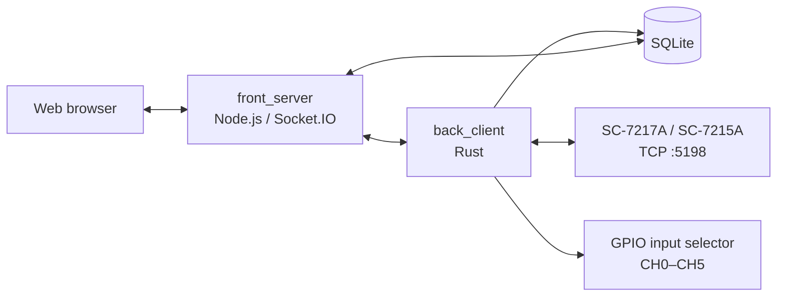

# labori

SC-7217A / SC-7215A 周波数カウンタから測定値を収集し、SQLite への保存、ブラウザでのリアルタイム表示、履歴表示、CSV 出力を行うシステムです。Raspberry Pi 上での運用を主な対象としています。

> [!IMPORTANT]
> 本プロジェクトは開発中です。実験装置へ組み込む前に、使用する Raspberry Pi、SC-7217A / SC-7215A、入力切替回路の組み合わせで十分に動作確認してください。

## できること

- SC-7217A / SC-7215A と LAN（TCP ポート `5198`）で通信
- 単一入力を連続測定
- Raspberry Pi の GPIO を使った最大6チャンネルの順次測定
- 測定値と測定条件を SQLite に保存
- ブラウザで測定値をリアルタイム表示
- 過去データの表示、CSV ダウンロード、削除
- 改行区切り JSON/TCP API からの直接操作

## システム構成



`back_client` が計測器との通信とデータ保存を担当し、`front_server` が Web UI と SQLite の読み出しを担当します。両プロセスは、同じ SQLite ファイルを参照する必要があります。

## ディレクトリ構成

```text
labori/
├── back_client/
│   ├── src/
│   │   ├── main.rs       # 設定読込と各タスクの起動
│   │   ├── server.rs     # ローカル JSON/TCP API
│   │   ├── client.rs     # SC-7217A 通信、測定制御、GPIO 制御
│   │   ├── logger.rs     # SQLite への保存
│   │   ├── model.rs      # API のコマンド、応答、入力検証
│   │   ├── config.rs     # バックエンド設定
│   │   └── error.rs      # エラー型
│   ├── tcp_test/
│   │   └── tcp_client.py # API の簡易テストクライアント
│   ├── Cargo.toml
│   └── config.toml
├── front_server/
│   ├── index.js          # Express / Socket.IO サーバー
│   ├── index.html        # 単一チャンネル UI
│   ├── index-multi.html  # 多チャンネル UI
│   ├── public/           # ブラウザ用 JS、CSS、Plotly
│   ├── package.json
│   └── config.toml
└── README.md
```

## 必要なもの

### ハードウェア

- Raspberry Pi
- Raspberry Pi OS
- IWATSU SC-7217A または SC-7215A
- Raspberry Pi と計測器を接続する LAN
- 多チャンネル測定を使う場合は、GPIO で制御できる入力切替回路

### ソフトウェア

- Rust stable toolchain
- Node.js `18` または `20`
- npm
- Git
- Python 3（API テストスクリプトを使う場合のみ）

Node.js 21 以降は、このリポジトリの依存関係ではサポート対象外です。

## SC-7217A / SC-7215A の準備

1. 計測器の LAN を有効にします。
2. Raspberry Pi から到達できる固定 IP アドレスを設定します。
3. 計測器の TCP コマンドポート `5198` に接続できることを確認します。
4. 測定対象に合わせて入力、トリガ、インピーダンスなどを計測器側で設定します。

labori が主に使用するリモートコマンドは次のとおりです。

| コマンド | 用途 |
|---|---|
| `:FUNC?` / `:FUNC <value>` | 測定ファンクションの取得・設定 |
| `:GATE:TIME?` / `:GATE:TIME <value>` | ゲート時間の取得・設定 |
| `:MEAS?` | 1回の測定値取得 |
| `:FRUN 0` / `:FRUN 1` | ホールド / フリーラン |
| `:LOG:LEN`、`:LOG:CLE`、`:LOG:DATA?` | 計測器内蔵ログの制御・取得 |

コマンド送信時は LF を終端文字として使用します。計測器の詳しい設定とコマンド仕様は、SC-7217A / SC-7215A の取扱説明書を参照してください。

## セットアップ

リポジトリを取得します。

```bash
git clone https://github.com/korintje/labori.git
cd labori
```

### 1. バックエンド

`back_client/config.toml` を環境に合わせて編集します。

```toml
device_name = "Iwatsu"
device_addr = "192.168.201.44:5198"
api_port = 50001
database_path = "Iwatsu.db"
gpio_settle_millis = 10
```

| 項目 | 説明 |
|---|---|
| `device_name` | 計測器を識別する名前。現在は表示用の設定です |
| `device_addr` | 計測器の `<IPアドレス>:5198` |
| `api_port` | `front_server` から受け付けるローカル API ポート |
| `database_path` | SQLite ファイル。相対パスはこの設定ファイルを基準に解決されます |
| `gpio_settle_millis` | 多チャンネル測定で入力切替後に待つ時間（ms） |

ビルドします。

```bash
cd back_client
cargo build --release
```

### 2. フロントエンド

`front_server/config.toml` を確認します。

```toml
[WS_server]
address = "127.0.0.1"
port = 3000

[TCP_client]
address = "127.0.0.1"
port = 50001
timeout_ms = 10000

[database]
sampling_rate = 100
path = "../back_client/Iwatsu.db"
```

| 項目 | 説明 |
|---|---|
| `WS_server.address` | Web サーバーの待受アドレス |
| `WS_server.port` | Web サーバーのポート |
| `TCP_client.address` | バックエンド API のアドレス |
| `TCP_client.port` | `back_client.api_port` と同じ値 |
| `TCP_client.timeout_ms` | バックエンド応答のタイムアウト（ms） |
| `database.sampling_rate` | ライブ表示用 DB ポーリング周期（ms） |
| `database.path` | `back_client.database_path` と同じ SQLite ファイル |

依存パッケージをインストールします。

```bash
cd ../front_server
npm ci
```

## 起動

2つのターミナルを使用します。

ターミナル1:

```bash
cd labori/back_client
cargo run --release -- config.toml
```

ビルド済みバイナリを直接起動する場合:

```bash
cd labori/back_client
./target/release/labori config.toml
```

設定ファイルは、第1コマンドライン引数、環境変数 `LABORI_CONFIG`、カレントディレクトリの `config.toml` の順に選択されます。

ターミナル2:

```bash
cd labori/front_server
npm start
```

起動後、Raspberry Pi 上のブラウザで次を開きます。

- 単一チャンネル: <http://127.0.0.1:3000/app/qcm>
- 多チャンネル: <http://127.0.0.1:3000/app/qcm-multi>

別の PC から Web UI を開く場合は、`front_server/config.toml` の `WS_server.address` を `0.0.0.0` に変更し、`http://<Raspberry PiのIPアドレス>:3000/app/qcm` を開きます。

> [!WARNING]
> Web UI に認証機能はありません。外部公開せず、信頼できる実験用 LAN 内だけで使用してください。バックエンド API 自体は `127.0.0.1` のみにバインドされます。

## Web UI の使い方

### 単一チャンネル測定

1. `Set Interval` でゲート時間を選択します。
2. `Run` を押します。
3. ライブグラフで測定値を確認します。
4. `Stop` を押して測定を終了します。
5. 履歴一覧から測定テーブルを選び、表示、CSV 保存、削除を行います。

単一チャンネル UI は、ゲート時間を設定した後に `RunExt` モードを開始し、`:MEAS?` を繰り返して測定します。

### 多チャンネル測定

1. 使用する `CH0`–`CH5` を選択します。
2. `Set Interval` で各チャンネルのゲート時間を選択します。
3. `Run` を押します。
4. 選択したチャンネルが順番に切り替わり、チャンネル別グラフへ表示されます。
5. `Stop` を押して測定を終了します。

多チャンネル測定では、チャンネルごとに「GPIO を HIGH → 安定待ち → `:MEAS?` → GPIO を LOW」の順で処理します。そのため、各チャンネルの更新周期は概ね次の値になります。

```text
選択チャンネル数 ×（ゲート時間 + GPIO安定待ち時間 + 通信処理時間）
```

## GPIO の割り当て

番号は物理ピン番号ではなく BCM GPIO 番号です。

| labori チャンネル | BCM GPIO |
|---:|---:|
| CH0 | GPIO17 |
| CH1 | GPIO27 |
| CH2 | GPIO22 |
| CH3 | GPIO23 |
| CH4 | GPIO24 |
| CH5 | GPIO25 |

測定開始時と終了時には使用する出力を LOW にします。切替回路側でも、起動時の GPIO 状態やプロセス異常終了を考慮した安全な設計にしてください。

## 測定モード

| API コマンド | 動作 | 主な用途 |
|---|---|---|
| `Run` | 計測器の内蔵ログを開始し、`:LOG:DATA?` で取得 | 低レベル API からの高速な単一入力収集 |
| `RunExt` | フリーランを停止し、`:MEAS?` を逐次実行 | 単一チャンネル Web UI |
| `RunMulti` | GPIO で入力を切り替え、`:MEAS?` を逐次実行 | 多チャンネル Web UI |

`RunExt` と `RunMulti` を API から直接使う場合は、先に `Set Interval` を実行してください。指定した `duration` / `interval` と実機のゲート時間を一致させる必要があります。

## ローカル JSON/TCP API

バックエンドは `127.0.0.1:<api_port>` で待ち受けます。1接続につき1コマンドを UTF-8 JSON として送り、末尾に LF（`\n`）を付けます。応答も1行の JSON です。1リクエストの上限は 64 KiB です。

### コマンド例

```json
{"Get":{"key":"Interval"}}
{"Get":{"key":"Func"}}
{"Set":{"key":"Interval","value":"1.0E-3"}}
{"Set":{"key":"Func","value":"FINA"}}
{"Run":{}}
{"RunExt":{"duration":"0.001"}}
{"RunMulti":{"channels":[0,1,2,3],"interval":0.001}}
{"Stop":{}}
```

利用可能なファンクション値:

```text
FINA, FINB, FINC, FLIN, PER, DUTY, PWID, TINT, FRAT, PHAS, TOT, VPPA, VPPB
```

利用可能な `Set Interval` 値:

```text
0.00001, 0.0001, 0.001, 0.01, 0.1, 1, 10
10E-6, 0.10E-3, 1.0E-3, 10E-3, 0.10E+0, 1.0E+0, 10.0E+0
```

`RunExt.duration` と `RunMulti.interval` は、0より大きく10秒以下である必要があります。多チャンネル番号は `0`–`5` です。

### 応答例

```json
{"Success":{"GotValue":"1.0E-3"}}
{"Success":{"SetValue":"1.0E-3"}}
{"Success":{"SaveTable":"2026-06-23T12-34-56.123456-0001"}}
{"Success":{"Finished":"Measurement successfully finished"}}
{"Failure":{"Busy":{"table_name":"2026-06-23T12-34-56.123456-0001","interval":"1.0E-3"}}}
{"Failure":{"MachineNotRespond":"..."}}
```

主な失敗応答:

| 応答 | 意味 |
|---|---|
| `Busy` | 測定中のため、別のコマンドを実行できない |
| `NotRunning` | 測定していない状態で停止を要求した |
| `InvalidRequest` / `InvalidCommand` | JSON、キー、値、範囲が不正 |
| `CommandNotSent` / `PollerCommandNotSent` | 計測器へコマンドを送信できなかった |
| `MachineNotRespond` / `EmptyStream` | 計測器またはバックエンドへ接続・応答できなかった |
| `SaveDataFailed` | SQLite への保存に失敗した |
| `ErrorInRunning` | GPIO 初期化など測定開始後の処理に失敗した |

簡易テスト:

```bash
cd back_client
python3 tcp_test/tcp_client.py
```

このスクリプトはゲート時間を設定し、`Run` を約10秒実行して停止します。実機が接続され、バックエンドが起動している状態で実行してください。

## SQLite データ

SQLite ファイルは初回測定時に自動作成されます。測定ごとに、日時と連番から生成した新しいテーブルを作ります。

### 管理テーブル

```sql
registry (
    table_name TEXT,
    channels   TEXT,
    interval   REAL
)
```

### 単一チャンネルテーブル

```sql
(
    time REAL,     -- 測定開始からの経過時間（秒）
    freq REAL,     -- 測定値
    rate INTEGER   -- 受信した値の文字列長
)
```

### 多チャンネルテーブル

```sql
(
    channel    INTEGER,
    start_time REAL, -- 測定開始から計測開始までの時間（秒）
    end_time   REAL, -- 測定開始から計測終了までの時間（秒）
    freq       REAL  -- 測定値
)
```

`front_server` は `registry` を使って単一チャンネルと多チャンネルのテーブルを判別します。古い DB に `registry` がない場合は、列構成から測定モードを推定します。

## 開発時の確認

フロントエンドの構文確認:

```bash
cd front_server
npm test
```

Rust の確認:

```bash
cd back_client
cargo fmt --check
cargo check
cargo test
```

API の疎通確認には `back_client/tcp_test/tcp_client.py` を利用できます。SC-7217A / SC-7215A と GPIO を含む測定動作は、実機上で別途確認してください。

## トラブルシュート

### Web UI が `disconnected` のまま

- `front_server` が起動しているか確認する
- URL と `WS_server.port` が一致しているか確認する
- 別 PC から接続する場合は `WS_server.address = "0.0.0.0"` になっているか確認する

### `MachineNotRespond` または `EmptyStream`

- SC-7217A / SC-7215A の IP アドレスと `device_addr` を確認する
- Raspberry Pi から計測器へ ping が通るか確認する
- TCP ポート `5198` が利用可能か確認する
- `front_server` の `TCP_client.port` とバックエンドの `api_port` を一致させる

### 履歴が表示されない

- バックエンドとフロントエンドが同じ SQLite ファイルを参照しているか確認する
- `database.path` の相対パスは、それぞれの設定ファイルの場所を基準に考える
- 測定開始後に `SaveTable` 応答が返っているか確認する

### 多チャンネル測定を開始できない

- Raspberry Pi 上で実行しているか確認する
- CH0–CH5 のうち少なくとも1つを選択する
- GPIO17、27、22、23、24、25 が他の用途と競合していないか確認する
- 実行ユーザーが GPIO を操作できるか確認する

### `npm ci` または `sqlite3` の導入に失敗する

- Node.js が 18 または 20 であることを確認する
- Raspberry Pi OS のビルドツールと Python が利用可能か確認する
- 異なる OS や Node.js バージョンで作成した `node_modules` を流用せず、対象機上で `npm ci` を実行する

## 現在の制約

- Web UI と API に認証・TLS はありません。
- 同時に実行できる測定は1つです。
- バックエンド API はローカルホストからのみ接続できます。
- 多チャンネル切替回路はプロジェクトに含まれません。
- 実機依存の通信タイミング、GPIO 電気特性、入力切替後の安定時間は環境ごとの検証が必要です。

## License

バックエンドのライセンスは [back_client/LICENSE](back_client/LICENSE) を参照してください。
