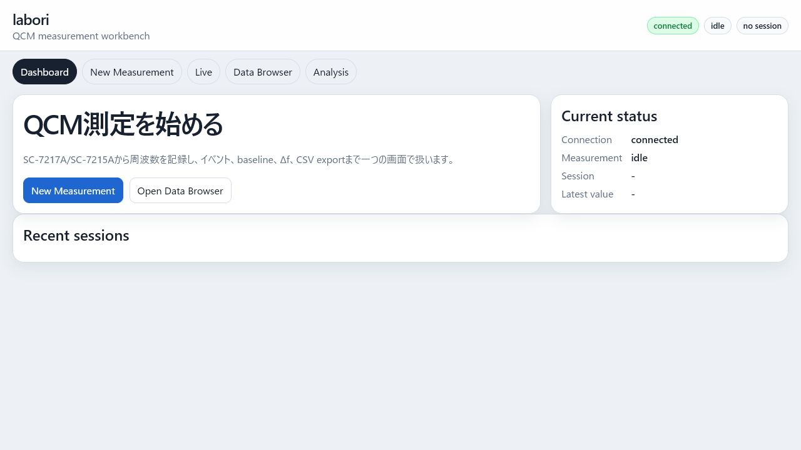
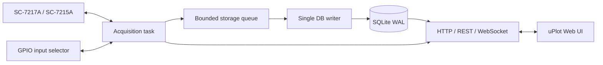

# labori



labori は、IWATSU SC-7217A / SC-7215A 周波数カウンタを Raspberry Pi などから LAN 制御し、水晶振動子マイクロバランス（QCM）の測定、記録、イベント管理、閲覧、簡易解析を行うローカルWebアプリケーションです。

Rust の単一バックエンドが、測定制御、SQLite保存、REST API、WebSocket配信、静的Web UI配信を担当します。フロントエンドは uPlot ベースの静的HTML/CSS/JavaScriptで、実行時に Node.js や外部CDNを必要としません。

## 設計方針

- 測定タスクは SQLite 書き込みやブラウザ描画を待たない
- SQLite 書き込みは単一 writer に集約する
- キューが飽和したら値を黙って捨てず、セッションを失敗として終了する
- 各サンプルには `started_ns` / `ended_ns` の単調時刻を保存する
- 通信断、再接続、実験イベントをセッションイベントとして保存する
- フロントエンドは uPlot で軽量に描画する
- Raspberry Pi 運用時に Node.js を要求しない

## 測定モード

### `single_direct`

SC-7217AをHOLD状態にし、ホスト側から `:MEAS?` を1回ずつ送信します。長時間測定で実時間と記録時刻の一致を重視する標準モードです。

```text
:GATE:TYPE INT
:GATE:TIME <gate_seconds>
:FRUN 0
loop:
    optional wait until next period_seconds slot
    record started_ns
    :MEAS?
    record ended_ns
    save sample
```

`period_seconds` が `null` または未指定の場合は、応答後すぐ次の `:MEAS?` を送ります。

### `single_log`

装置側のフリーランと内蔵ログを使います。

```text
:GATE:TYPE INT
:GATE:TIME <gate_seconds>
:DISP:SRAT <period_seconds>
:LOG:LEN 5e5
:LOG:CLE
:FRUN 1
loop:
    :LOG:DATA?
```

高スループットが期待できますが、長時間測定で装置内ログの時間軸と実時間がずれる可能性があります。実時間軸を重視する場合は `single_direct` を使ってください。

### `multi`

GPIOで入力チャンネルを切り替えながら、各チャンネルを `:MEAS?` で測定します。

```text
:GATE:TYPE INT
:GATE:TIME <gate_seconds>
:FRUN 0
loop:
    optional wait until next period_seconds slot
    GPIO select channel
    wait gpio_settle_millis
    record started_ns
    :MEAS?
    record ended_ns
    GPIO clear
    save sample
```

`period_seconds` は1サンプルごとの開始周期です。4チャンネルで `period_seconds = 0.01` の場合、一巡は約0.04秒以上になります。

## 時間パラメータ

`gate_seconds` は SC-7217A の内部ゲート時間です。有効値は次のいずれかです。

- `0.00001` — 10 us
- `0.0001` — 100 us
- `0.001` — 1 ms
- `0.01` — 10 ms
- `0.1` — 100 ms
- `1`
- `10`

`period_seconds` は測定開始周期です。

- `single_direct`: Raspberry Pi側で次の `:MEAS?` 開始時刻を制御
- `single_log`: `:DISP:SRAT` として装置側フリーラン周期に設定
- `multi`: 各チャンネルの各サンプル開始周期として使用

## Web UI

フロントエンドは、QCM用のワークベンチとして構成されています。

- Dashboard
- New Measurement
- Live
- Data Browser
- Analysis

### Dashboard

接続状態、測定状態、現在セッション、最新値、最近のセッションを確認します。

### New Measurement

測定名、サンプル名、実験者、水晶振動子ID、メモ、測定モード、ゲート時間、開始周期、チャンネルを設定して測定を開始します。

### Live

WebSocketで届くライブデータを uPlot で表示します。

- frequency / Δf 表示切り替え
- baseline設定
- 添加、洗浄、バッファ交換、メモなどのイベント追加
- サンプル数、最新値、平均、標準偏差、drift表示

### Data Browser

セッション一覧をテーブルで表示し、タイトル、サンプル、メモ、状態などから検索できます。

### Analysis

選択したセッションを読み込み、frequencyまたはΔfで表示します。CSV exportには測定条件、メモ、イベント、baseline設定時の `delta_frequency` 列が含まれます。

## 構成



| ファイル | 役割 |
|---|---|
| `back_client/src/acquisition.rs` | SC-7217A通信、測定ループ、GPIO、再接続 |
| `back_client/src/storage.rs` | SQLite schema、単一writer、バッチ保存、履歴読み出し |
| `back_client/src/web.rs` | REST API、WebSocket、静的ファイル配信 |
| `back_client/src/model.rs` | APIと保存データの型 |
| `web/index.html` | QCMワークベンチUI |
| `web/public/client.js` | uPlot描画、API操作、UI状態管理 |
| `web/public/uPlot.*` | ローカル同梱したuPlot配布ファイル |

## セットアップ

```bash
git clone https://github.com/korintje/labori.git
cd labori/back_client
```

`config.toml` を編集します。

```toml
device_addr = "192.168.201.44:5198"
measurement_function = "FINA"
listen_addr = "127.0.0.1:3000"
database_path = "labori.db"
web_root = "../web"

gpio_settle_millis = 10
instrument_timeout_millis = 15000
reconnect_millis = 500
storage_queue_capacity = 100000
storage_batch_size = 1000
storage_flush_millis = 100
```

## ビルドと起動

```bash
cargo build --release
cargo run --release -- config.toml
```

ブラウザで開きます。

- <http://127.0.0.1:3000/>
- <http://127.0.0.1:3000/multi> は `/?mode=multi` へ誘導されます

## REST API

### 状態

```http
GET /api/status
```

### 測定開始

```http
POST /api/measurements/start
Content-Type: application/json

{
  "mode": "single_direct",
  "gate_seconds": 0.001,
  "period_seconds": 0.01,
  "title": "BSA adsorption run 1",
  "sample_name": "1 mg/mL BSA",
  "note": "PBS, 25 C, crystal QCM-001",
  "channels": []
}
```

multiの場合:

```json
{
  "mode": "multi",
  "gate_seconds": 0.001,
  "period_seconds": 0.01,
  "title": "buffer screen",
  "sample_name": "PBS series",
  "note": "CH0 control",
  "channels": [0, 1, 2, 3]
}
```

### 測定停止

```http
POST /api/measurements/stop
```

### セッション一覧

```http
GET /api/sessions
GET /api/sessions?mode=single
GET /api/sessions?mode=single_direct
GET /api/sessions?mode=single_log
GET /api/sessions?mode=multi
```

### サンプル読み出し

```http
GET /api/sessions/12/samples?after_sequence=-1&limit=10000
```

### イベント

```http
GET /api/sessions/12/events
POST /api/sessions/12/events
Content-Type: application/json

{"kind":"injection","message":"sample injected","at_sequence":1234}
```

## SQLite

### `sessions`

```text
id, started_at, ended_at, mode, gate_seconds, period_seconds,
title, sample_name, note, channels, state, sample_count, error
```

### `samples`

```text
session_id, sequence, channel, started_ns, ended_ns, value
```

### `session_events`

```text
session_id, created_at, at_sequence, kind, message
```

## 検証

```bash
cd back_client
cargo fmt --check
cargo clippy --all-targets -- -D warnings
cargo test
```

JavaScript:

```bash
node --check ../web/public/client.js
node --check ../web/public/client-multi.js
```

実機では以下を確認してください。

1. `single_direct` のCSV時間軸が実時間と一致すること
2. `single_log` で `period_seconds` が装置側フリーラン周期に効くこと
3. イベントマーカーが測定中・履歴表示中に保存されること
4. multiモードでチャンネル選択と保存チャンネルが一致すること
5. 長時間測定でブラウザ表示が測定記録を妨げないこと

## License

[back_client/LICENSE](back_client/LICENSE) を参照してください。
