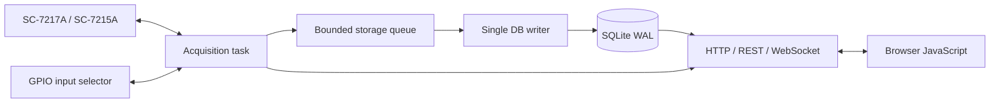

# labori

labori は、IWATSU SC-7217A / SC-7215A 周波数カウンタを Raspberry Pi などから LAN 制御し、測定値をリアルタイム表示しながら SQLite に記録するためのソフトウェアです。

現在の設計では、フロントエンド用の Node.js サーバは使いません。Rust の単一プロセスが、測定制御、DB 書き込み、REST API、WebSocket、静的 Web UI 配信をまとめて担当します。ブラウザ側には表示と操作のための小さな JavaScript だけを残しています。

## 設計方針

- 測定タスクは SQLite 書き込みを待たない
- SQLite 書き込みは単一 writer に集約する
- キューが飽和したら黙って捨てず、セッションを失敗として終了する
- 各サンプルには単調時刻の `started_ns` / `ended_ns` を保存する
- 通信断や再接続はイベントとして保存する
- 起動時に未完了セッションを `interrupted` として確定する
- UI のライブ表示は WebSocket、履歴表示は REST API で行う

## 測定モード

### `single_direct` — `:MEAS?` 直接測定

長時間測定で、記録された時間軸と実時間の一致を優先するモードです。

開始時に SC-7217A を HOLD 状態にし、ホスト側から `:MEAS?` を 1 回ずつ送ります。

```text
:GATE:TYPE INT
:GATE:TIME <gate_seconds>
:FRUN 0
loop:
    optional wait until next period_seconds slot
    record started_ns
    :MEAS?
    record ended_ns
    save sample
```

`period_seconds` を指定した場合は、Raspberry Pi 側の単調時刻で次の測定開始予定時刻まで待ちます。測定や通信が予定より長引いた場合は待たずに次へ進みますが、保存される時刻は実測時刻のままです。

`period_seconds` を省略または `null` にした場合は、前回の応答後すぐ次の `:MEAS?` を送ります。

### `single_log` — 装置内蔵ログ

SC-7217A 側のフリーランとログ機能を使うモードです。高いスループットが期待できますが、長時間測定では装置内部ログの時間軸と実時間がずれる可能性があります。

```text
:GATE:TYPE INT
:GATE:TIME <gate_seconds>
:DISP:SRAT <period_seconds>
:LOG:LEN 5e5
:LOG:CLE
:FRUN 1
loop:
    :LOG:DATA?
```

`single_log` では `period_seconds` がフリーランの繰り返し周期として使われます。未指定の場合は `gate_seconds` と同じ値に正規化します。

重要: `:LOG:DATA?` のデータ消費動作、応答サイズ上限、ログ満杯時の挙動は実機ファームウェアに依存します。実時間と一致する時間軸が最重要なら `single_direct` を使ってください。

### `multi` — GPIO 切り替え + `:MEAS?`

Raspberry Pi の GPIO で入力を切り替えながら、各チャンネルを `:MEAS?` で測定します。

```text
:GATE:TYPE INT
:GATE:TIME <gate_seconds>
:FRUN 0
loop:
    optional wait until next period_seconds slot
    GPIO select channel
    wait gpio_settle_millis
    record started_ns
    :MEAS?
    record ended_ns
    GPIO clear
    save sample
```

`period_seconds` は「1サンプルごとの開始周期」です。たとえば 4 チャンネルを選択して `period_seconds = 0.01` にした場合、チャンネル一巡は約 0.04 秒以上になります。

## 時間パラメータ

### `gate_seconds`

SC-7217A の内部ゲート時間です。マニュアル上、有効値は次の離散値です。

- `0.00001` — 10 us
- `0.0001` — 100 us
- `0.001` — 1 ms
- `0.01` — 10 ms
- `0.1` — 100 ms
- `1`
- `10`

labori は、装置側で丸めが起きて時間軸の意味が曖昧になることを避けるため、この値以外を受け付けません。

### `period_seconds`

測定開始周期です。

- `single_direct`: Raspberry Pi 側で次の `:MEAS?` 開始時刻を制御します
- `single_log`: `:DISP:SRAT` として装置側フリーラン周期に設定します
- `multi`: 各チャンネルの各サンプル開始周期として使います

`single_direct` と `multi` では `null` または省略により「可能な限り速く」測定します。`single_log` では省略時に `gate_seconds` と同じ値へ正規化します。

## 構成



| ファイル | 役割 |
|---|---|
| `back_client/src/acquisition.rs` | SC-7217A 通信、測定ループ、GPIO、再接続 |
| `back_client/src/storage.rs` | SQLite schema、単一 writer、バッチ保存、履歴読み出し |
| `back_client/src/web.rs` | REST API、WebSocket、静的ファイル配信 |
| `back_client/src/model.rs` | API と保存データの型 |
| `back_client/src/config.rs` | 設定読み込みと検証 |
| `web/` | 静的 Web UI |

## 必要なもの

- Raspberry Pi OS
- Rust stable toolchain
- IWATSU SC-7217A または SC-7215A
- 測定器へ到達できる LAN
- multi モードを使う場合は GPIO 入力切り替え回路

Node.js と npm は実行時には不要です。

## セットアップ

```bash
git clone https://github.com/korintje/labori.git
cd labori/back_client
```

`config.toml` を編集します。

```toml
device_addr = "192.168.201.44:5198"
measurement_function = "FINA"
listen_addr = "127.0.0.1:3000"
database_path = "labori.db"
web_root = "../web"

gpio_settle_millis = 10
instrument_timeout_millis = 15000
reconnect_millis = 500
storage_queue_capacity = 100000
storage_batch_size = 1000
storage_flush_millis = 100
```

| 設定 | 説明 |
|---|---|
| `device_addr` | 測定器の LAN アドレス。SC-7217A の標準ポートは `5198` |
| `measurement_function` | 測定ファンクション。既定値は `FINA` |
| `listen_addr` | Web UI と API の待受アドレス |
| `database_path` | SQLite ファイル |
| `web_root` | HTML/CSS/JavaScript の配置先 |
| `gpio_settle_millis` | GPIO 切り替え後の安定待ち時間 |
| `instrument_timeout_millis` | 測定器応答タイムアウト |
| `reconnect_millis` | 再接続の初期待ち時間 |
| `storage_queue_capacity` | 測定タスクと DB writer 間のキュー容量 |
| `storage_batch_size` | 1 トランザクションの最大サンプル数 |
| `storage_flush_millis` | 少量データを確定する最大待ち時間 |

## ビルドと起動

```bash
cargo build --release
cargo run --release -- config.toml
```

ビルド済みバイナリを直接実行する場合:

```bash
./target/release/labori config.toml
```

ブラウザで開きます。

- 単一チャンネル: <http://127.0.0.1:3000/>
- 複数チャンネル: <http://127.0.0.1:3000/multi>

別 PC から使う場合は `listen_addr = "0.0.0.0:3000"` にします。認証や TLS は実装していないため、信頼できる実験用 LAN 内で使ってください。

## REST API

### 状態

```http
GET /api/status
```

### 測定開始

単一チャンネル、`:MEAS?` 直接測定:

```http
POST /api/measurements/start
Content-Type: application/json

{"mode":"single_direct","gate_seconds":0.001,"period_seconds":0.01}
```

単一チャンネル、`:MEAS?` を最短間隔で繰り返す:

```http
POST /api/measurements/start
Content-Type: application/json

{"mode":"single_direct","gate_seconds":0.001,"period_seconds":null}
```

単一チャンネル、装置内蔵ログ:

```http
POST /api/measurements/start
Content-Type: application/json

{"mode":"single_log","gate_seconds":0.001,"period_seconds":0.01}
```

複数チャンネル:

```http
POST /api/measurements/start
Content-Type: application/json

{"mode":"multi","gate_seconds":0.001,"period_seconds":0.01,"channels":[0,1,2,3]}
```

### 測定停止

```http
POST /api/measurements/stop
```

停止要求後、受理済みサンプルを DB へ flush してからセッションを確定します。

### セッション一覧

```http
GET /api/sessions
GET /api/sessions?mode=single
GET /api/sessions?mode=single_direct
GET /api/sessions?mode=single_log
GET /api/sessions?mode=multi
```

### サンプル読み出し

```http
GET /api/sessions/12/samples?after_sequence=-1&limit=10000
```

`limit` の最大値は 50,000 です。

### イベント読み出し

```http
GET /api/sessions/12/events
```

通信断、再接続、欠損推定など、サンプル値とは別の品質情報を取得できます。

### セッション削除

```http
DELETE /api/sessions/12
```

実行中のセッションは削除できません。

## SQLite

起動時に次を設定します。

- `journal_mode = WAL`
- `synchronous = NORMAL`
- `busy_timeout = 5 sec`
- `foreign_keys = ON`

### `sessions`

```text
id, started_at, ended_at, mode, gate_seconds, period_seconds,
channels, state, sample_count, error
```

`mode` は `single_direct`、`single_log`、`multi` のいずれかです。

状態:

- `running`
- `completed`
- `completed_with_errors`
- `failed`
- `interrupted`

### `samples`

```text
session_id, sequence, channel, started_ns, ended_ns, value
```

`started_ns` と `ended_ns` は、セッション開始からの単調時刻です。

### `session_events`

```text
session_id, created_at, at_sequence, kind, message
```

## GPIO 割り当て

BCM 番号です。

| チャンネル | GPIO |
|---:|---:|
| CH0 | 17 |
| CH1 | 27 |
| CH2 | 22 |
| CH3 | 23 |
| CH4 | 24 |
| CH5 | 25 |

測定前、測定後、エラー時、プロセス終了時に GPIO を LOW へ戻します。

## データ保護の考え方

測定タスクはサンプルを有界キューへ `try_send` し、SQLite 完了を待ちません。キューが満杯になった場合、時刻を歪めて待つことも、値を黙って捨てることもしません。セッションを `failed` として停止します。

突然の電源断では、キュー内または未確定トランザクション内のデータが失われる可能性があります。重要な測定では次を推奨します。

- Raspberry Pi へ UPS を接続する
- 高耐久 SD カードまたは SSD を使う
- OS の時刻同期を有効にする
- 必要に応じて SQLite の `synchronous` を `FULL` に変更する

## 検証

```bash
cd back_client
cargo fmt --check
cargo clippy --all-targets -- -D warnings
cargo test
```

ブラウザ JavaScript:

```bash
node --check ../web/public/client.js
node --check ../web/public/client-multi.js
```

実機では最低限、次を確認してください。

1. 既知のゲート時間で `:GATE:TIME?` が要求値と一致すること
2. `single_direct` で長時間測定して、CSV の時間軸が実時間と一致すること
3. `single_log` で `period_seconds` を変えた時にログの増加速度が変わること
4. LAN ケーブル切断と再接続後もセッションが継続し、イベントが残ること
5. multi モードで GPIO の選択チャンネルと保存チャンネルが一致すること

## ディレクトリ

```text
labori/
├── back_client/
│   ├── src/
│   │   ├── acquisition.rs
│   │   ├── storage.rs
│   │   ├── web.rs
│   │   ├── model.rs
│   │   ├── config.rs
│   │   ├── error.rs
│   │   └── main.rs
│   ├── Cargo.toml
│   └── config.toml
├── web/
│   ├── index.html
│   ├── index-multi.html
│   └── public/
└── README.md
```

## License

[back_client/LICENSE](back_client/LICENSE) を参照してください。
